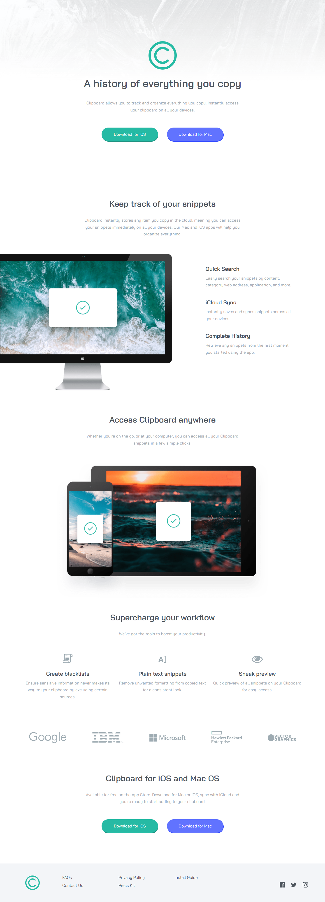
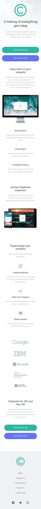

# Clipboard Landing Page With React js

Solution of [Clipboard landing page challenge on Frontend Mentor](https://www.frontendmentor.io/challenges/clipboard-landing-page-5cc9bccd6c4c91111378ecb9).

- 14 April 2022.

## Table of contents

- [Screenshot-Desktop](#screenshot-desktop)
- [Screenshot-Mobile](#screenshot-mobile)
- [Links](#links)
- [Built with](#built-with)
- [Useful resources](#useful-resources)
- [Author](#author)
- [Date](#date)

## Screenshot Desktop

## Screenshot Mobile

## Links

- Solution URL: [Solution](https://www.frontendmentor.io/solutions/clipboard-landing-page-by-using-react-HJOE6WBV9)
- Live Site URL: [Live](https://ethenpage.github.io/re-clipboard-landing-page/)

## Built with

- [React](https://reactjs.org/) - JS library

## Useful resources

- [Font Size](https://type-scale.com/)

## Author

- Name - Ethen
- Frontend Mentor - [@EthenPage](https://www.frontendmentor.io/profile/ethenpage)

## Date

-14 April 2022
